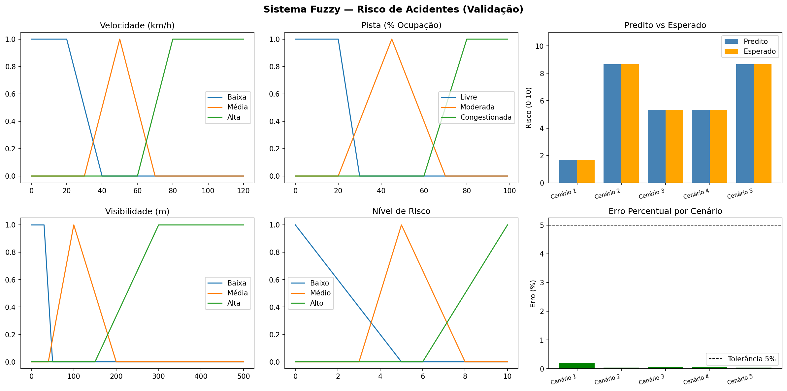

# Risco de Acidentes com Lógica Fuzzy

## Descrição do Projeto
Este projeto desenvolve um sistema especialista baseado em **Lógica Fuzzy (Mamdani)** para avaliar o risco de ocorrência de acidentes de trânsito em rodovias, servindo como uma ferramenta auxiliar para tomadas de decisões mais seguras no trânsito.

O sistema utiliza informações relacionadas às condições de condução, como velocidade do veículo, condição da pista e visibilidade, para estimar o nível de risco de acidente.

## Objetivo
Desenvolver uma aplicação prática utilizando Lógica Fuzzy capaz de determinar o nível de risco de acidente a partir de fatores que influenciam diretamente a segurança no trânsito.

- Receber valores de entrada referentes às condições de condução;
- Aplicar regras fuzzy;
- Realizar o processo de inferência fuzzy;
- Efetuar a defuzzificação;
- Apresentar um índice de risco compreensível para o usuário.

## Abordagem adotada
O sistema foi implementado utilizando o método de inferência **Mamdani**.

As etapas consistem em:

1. Definição das variáveis linguísticas;
2. Construção das funções de pertinência;
3. Criação das regras fuzzy;
4. Inferência Mamdani;
5. Defuzzificação pelo método do centroide;
6. Interpretação do resultado final.

## Estrutura de Pastas
```text
Risco-de-acidentes-Logica-Fuzzy/
│
├── .gitignore
├── .cursorrules
├── acidentes.ipynb
├── enunciado.md
├── README.md
├── requirements.txt
└── docs/
    └── resultado.png
```

---

## Resultados da Validação dos Cenários
O sistema foi validado contra 5 cenários reais de trânsito com uma tolerância de erro de **5%** (conforme os requisitos acadêmicos). Todos os cenários foram aprovados:

| Cenário | Entradas (Vel / Pista / Vis) | Predito | Esperado | Erro % | Status |
| :--- | :--- | :---: | :---: | :---: | :---: |
| **Cenário 1 — Risco Baixo** | Vel: 20 km/h \| Pist: 10% \| Vis: 400m | 1.67 | 1.67 | 0.2% | ✅ Aprovado |
| **Cenário 2 — Risco Alto** | Vel: 100 km/h \| Pist: 85% \| Vis: 20m | 8.67 | 8.67 | 0.0% | ✅ Aprovado |
| **Cenário 3 — Risco Médio** | Vel: 50 km/h \| Pist: 45% \| Vis: 100m | 5.33 | 5.33 | 0.1% | ✅ Aprovado |
| **Cenário 4 — Alta Velocidade, Pista Livre** | Vel: 90 km/h \| Pist: 15% \| Vis: 350m | 5.33 | 5.33 | 0.1% | ✅ Aprovado |
| **Cenário 5 — Congestionamento com Neblina** | Vel: 25 km/h \| Pist: 80% \| Vis: 15m | 8.67 | 8.67 | 0.0% | ✅ Aprovado |

### Gráfico de Saída e Pertinências
O gráfico gerado pelo sistema (`docs/resultado.png`) ilustra as funções de pertinência das variáveis de entrada e saída, o comparativo entre os valores preditos e esperados, e a análise de erro percentual por cenário:



---

## Como Executar
1. Certifique-se de ter o Python instalado.
2. Instale as dependências necessárias:
   ```bash
   pip install -r requirements.txt
   ```
3. Abra o Jupyter Notebook ou Google Colab e execute as células do arquivo `acidentes.ipynb` em ordem.
